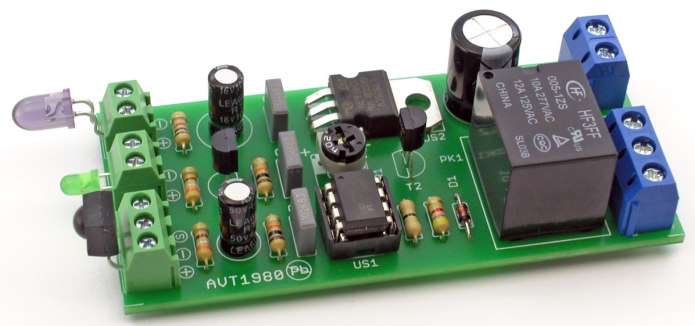
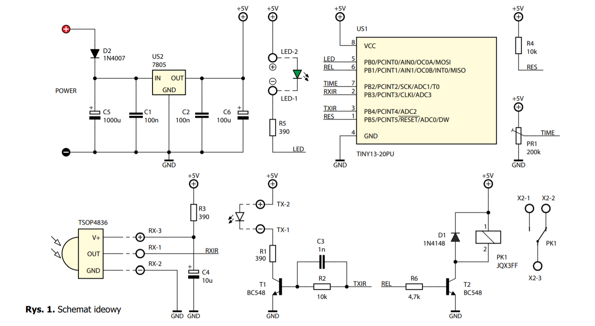

# Projekt Technika Mikroprocesorowa

## Czasowy włącznik zbliżeniowy
Jeżeli z jakiegoś powodu nie możemy dotkąć włącznika światła na przykład z powodu brudnych rąk o wiele wygodniejsze jest zbliżenie się do czujnika by go uruchomić. Działanie takiego czujnika opiera się na zasadzie wysyłania wiązki promieni podczerwieni przez nadajnik i ich odbieraniu przez odbiornik. Wiązka promieni świetlnych napytakając na swojej drodze przeszkodę, odbija się od niej zgodnie z prawami fizyki. Część tych promieni podczerwieni trafia do odbiornika, gdzie wzmocnione służą do wytworzenia sygnału przełączojącego.  

## Wykaz elementów 
### Rezystory:
R1:1k (OHM)  
R2,R4: 10k (OHM)  
R3,R5: 390 (OHM)  
R6:4,7k (OHM)  
Z:0 (OHM)  
PR1:200k (OHM)  
### Kondensatory
C1,C2:100 nF  
C3:1 nF  
C4:4,7 uF  
C5:1000 uF  
C6:100 uF  
### Półprzewodniki
D1: 1N4148  
D2: 1N4007  
LD1: dioda LED  
T1,T2: BC547  
US1: ATtiny25 + podstwka 8-pin  
US2: 7805  
### Inne
NAD, LED, X1: złącza śrubowe 2-pin  
OBD, X2: złącza śrubowe 3-pin  
PK1: przekaźnik  
## Schemat ideowy

